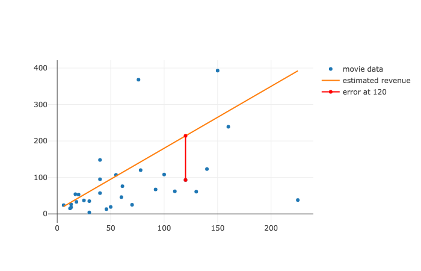

# Evaluating Regression Lines Lab

### Introduction

In the previous lesson, we learned to evaluate how well a regression line estimated our actual data.  In this lab, we will turn these formulas into code.  In doing so, we'll build lots of useful functions for both calculating and displaying our errors for a given regression line and dataset.

> In moving through this lab, we'll access to the functions that we previously built out to plot our data, available in the [graph](https://github.com/learn-co-curriculum/evaluating-regression-lines-lab/blob/master/graph.py) here.

### Determining Quality

In the file, `movie_data.py` you will find movie data written as a python list of dictionaries, with each dictionary representing a movie.  The movies are derived from the first 30 entries from the dataset containing 538 movies [provided here](https://raw.githubusercontent.com/fivethirtyeight/data/master/bechdel/movies.csv).


```python
from movie_data import movies 
len(movies)
```


```python
# __SOLUTION__ 
from movie_data import movies 
len(movies)
```


    30


> Press shift + enter


```python
movies[0]
```


```python
# __SOLUTION__ 
movies[0]
```


    {'budget': 13000000, 'domgross': 25682380.0, 'title': '21 &amp; Over'}


```python
movies[0]['budget']/1000000
```


```python
# __SOLUTION__ 
movies[0]['budget']/1000000
```


    13.0


The numbers are in millions, so we will simplify things by dividing everything by a million


```python
scaled_movies = list(map(lambda movie: {'title': movie['title'], 'budget': round(movie['budget']/1000000, 0), 'domgross': round(movie['domgross']/1000000, 0)}, movies))
scaled_movies[0]
```


```python
# __SOLUTION__ 
scaled_movies = list(map(lambda movie: {'title': movie['title'], 'budget': round(movie['budget']/1000000, 0), 'domgross': round(movie['domgross']/1000000, 0)}, movies))
scaled_movies[0]
```


    {'title': '21 &amp; Over', 'budget': 13.0, 'domgross': 26.0}


Note that, like in previous lessons, the budget is our explanatory value and the revenue is our dependent variable.  Here revenue is represented as the key `domgross`.  

#### Plotting our data

Let's write the code to plot this data set.

As a first task, convert the budget values of our `scaled_movies` to `x_values`, and convert the domgross values of the `scaled_movies` to `y_values`.


```python
x_values = None
y_values = None
```


```python
# __SOLUTION__ 
x_values = list(map(lambda movie: movie['budget'], scaled_movies))
y_values = list(map(lambda movie: movie['domgross'], scaled_movies))
```


```python
x_values and x_values[0] # 13.0
```


```python
# __SOLUTION__ 
x_values[0] # 13.0
```


    13.0


```python
y_values and y_values[0] # 26.0
```


```python
# __SOLUTION__ 
y_values[0] # 26.0
```


    26.0


Assign a variable called `titles` equal to the titles of the movies.


```python
titles = None
```


```python
# __SOLUTION__ 
titles = list(map(lambda movie: movie['title'], movies))
```


```python
titles and titles[0]
```


```python
# __SOLUTION__ 
titles and titles[0]
```


    '21 &amp; Over'


Great! Now we have the data necessary to make a trace of our data.


```python
from plotly.offline import iplot, init_notebook_mode
init_notebook_mode(connected=True)
from graph import trace_values, plot

movies_trace = trace_values(x_values, y_values, text=titles, name='movie data')

plot([movies_trace])
```


```python
# __SOLUTION__ 
from plotly.offline import iplot, init_notebook_mode
init_notebook_mode(connected=True)
from graph import trace_values, plot

movies_trace = trace_values(x_values, y_values, text=titles, name='movie data')

plot([movies_trace])
```


<script>requirejs.config({paths: { 'plotly': ['https://cdn.plot.ly/plotly-latest.min']},});if(!window.Plotly) {{require(['plotly'],function(plotly) {window.Plotly=plotly;});}}</script>


<script>requirejs.config({paths: { 'plotly': ['https://cdn.plot.ly/plotly-latest.min']},});if(!window.Plotly) {{require(['plotly'],function(plotly) {window.Plotly=plotly;});}}</script>


<div id="7cffd273-065c-4897-b6e8-67f896dbcffe" style="height: 525px; width: 100%;" class="plotly-graph-div"></div><script type="text/javascript">require(["plotly"], function(Plotly) { window.PLOTLYENV=window.PLOTLYENV || {};window.PLOTLYENV.BASE_URL="https://plot.ly";Plotly.newPlot("7cffd273-065c-4897-b6e8-67f896dbcffe", [{"mode": "markers", "name": "movie data", "text": ["21 &amp; Over", "Dredd 3D", "12 Years a Slave", "2 Guns", "42", "47 Ronin", "A Good Day to Die Hard", "About Time", "After Earth", "August: Osage County", "Beautiful Creatures", "Blue Jasmine", "Captain Phillips", "Carrie", "Cloudy with a Chance of Meatballs 2", "Despicable Me 2", "Don Jon", "Elysium", "Ender&#39;s Game", "Epic", "Escape Plan", "Evil Dead", "Fast and Furious 6", "Frozen", "G.I. Joe: Retaliation", "Gangster Squad", "Grown Ups", "Her", "Identity Thief", "Iron Man 3"], "x": [13.0, 46.0, 20.0, 61.0, 40.0, 225.0, 92.0, 12.0, 130.0, 25.0, 50.0, 18.0, 55.0, 30.0, 78.0, 76.0, 6.0, 120.0, 110.0, 100.0, 70.0, 17.0, 160.0, 150.0, 140.0, 60.0, 80.0, 23.0, 35.0, 200.0], "y": [26.0, 13.0, 53.0, 76.0, 95.0, 38.0, 67.0, 15.0, 61.0, 37.0, 19.0, 33.0, 107.0, 35.0, 120.0, 368.0, 24.0, 93.0, 62.0, 108.0, 25.0, 54.0, 239.0, 393.0, 123.0, 46.0, 134.0, 25.0, 135.0, 409.0], "type": "scatter", "uid": "7cf72136-c5dd-11e9-800e-3af9d3ad3e0b"}], {}, {"showLink": true, "linkText": "Export to plot.ly"})});</script>


#### Plotting a regression line

Now let's add a regression line to make a prediction of output (revenue) based on an input (the budget).  We'll use the following regression formula:

* $\hat{y} = m x + b$, with $m = 1.7$, and $b = 10$. 


* $\hat{y} = 1.7x + 10$

Write a function called `regression_formula` that calculates our $\hat{y}$ for any provided value of $x$. 


```python
def regression_formula(x):
    pass
```


```python
# __SOLUTION__ 
def regression_formula(x):
    return 10 + 1.7*x
```

Check to see that the regression formula generates the correct outputs.


```python
regression_formula(100) # 180.0
regression_formula(250) # 435.0
```


```python
# __SOLUTION__ 
regression_formula(100) # 180.0
regression_formula(250) # 435.0
```


    435.0


Let's plot the data as well as the regression line to get a sense of what we are looking at.


```python
from plotly.offline import iplot, init_notebook_mode
init_notebook_mode(connected=True)
from graph import trace_values, m_b_trace, plot

if x_values and y_values:
    movies_trace = trace_values(x_values, y_values, text=titles, name='movie data')
    regression_trace = m_b_trace(1.7, 10, x_values, name='estimated revenue')
    plot([movies_trace, regression_trace])
```


```python
# __SOLUTION__ 
from plotly.offline import iplot, init_notebook_mode
init_notebook_mode(connected=True)

from graph import trace_values, m_b_trace, plot
movies_trace = trace_values(x_values, y_values, text=titles, name='movie data')

regression_trace = m_b_trace(1.7, 10, x_values, name='estimated revenue')
plot([movies_trace, regression_trace])
```


<script>requirejs.config({paths: { 'plotly': ['https://cdn.plot.ly/plotly-latest.min']},});if(!window.Plotly) {{require(['plotly'],function(plotly) {window.Plotly=plotly;});}}</script>


<div id="8a53c2e4-b942-46ca-9fc8-41153d18be93" style="height: 525px; width: 100%;" class="plotly-graph-div"></div><script type="text/javascript">require(["plotly"], function(Plotly) { window.PLOTLYENV=window.PLOTLYENV || {};window.PLOTLYENV.BASE_URL="https://plot.ly";Plotly.newPlot("8a53c2e4-b942-46ca-9fc8-41153d18be93", [{"mode": "markers", "name": "movie data", "text": ["21 &amp; Over", "Dredd 3D", "12 Years a Slave", "2 Guns", "42", "47 Ronin", "A Good Day to Die Hard", "About Time", "After Earth", "August: Osage County", "Beautiful Creatures", "Blue Jasmine", "Captain Phillips", "Carrie", "Cloudy with a Chance of Meatballs 2", "Despicable Me 2", "Don Jon", "Elysium", "Ender&#39;s Game", "Epic", "Escape Plan", "Evil Dead", "Fast and Furious 6", "Frozen", "G.I. Joe: Retaliation", "Gangster Squad", "Grown Ups", "Her", "Identity Thief", "Iron Man 3"], "x": [13.0, 46.0, 20.0, 61.0, 40.0, 225.0, 92.0, 12.0, 130.0, 25.0, 50.0, 18.0, 55.0, 30.0, 78.0, 76.0, 6.0, 120.0, 110.0, 100.0, 70.0, 17.0, 160.0, 150.0, 140.0, 60.0, 80.0, 23.0, 35.0, 200.0], "y": [26.0, 13.0, 53.0, 76.0, 95.0, 38.0, 67.0, 15.0, 61.0, 37.0, 19.0, 33.0, 107.0, 35.0, 120.0, 368.0, 24.0, 93.0, 62.0, 108.0, 25.0, 54.0, 239.0, 393.0, 123.0, 46.0, 134.0, 25.0, 135.0, 409.0], "type": "scatter", "uid": "8fb348c2-c5dd-11e9-a201-3af9d3ad3e0b"}, {"mode": "lines", "name": "estimated revenue", "x": [13.0, 46.0, 20.0, 61.0, 40.0, 225.0, 92.0, 12.0, 130.0, 25.0, 50.0, 18.0, 55.0, 30.0, 78.0, 76.0, 6.0, 120.0, 110.0, 100.0, 70.0, 17.0, 160.0, 150.0, 140.0, 60.0, 80.0, 23.0, 35.0, 200.0], "y": [32.099999999999994, 88.2, 44.0, 113.7, 78.0, 392.5, 166.4, 30.4, 231.0, 52.5, 95.0, 40.599999999999994, 103.5, 61.0, 142.6, 139.2, 20.2, 214.0, 197.0, 180.0, 129.0, 38.9, 282.0, 265.0, 248.0, 112.0, 146.0, 49.1, 69.5, 350.0], "type": "scatter", "uid": "8fb34a0c-c5dd-11e9-9e3d-3af9d3ad3e0b"}], {}, {"showLink": true, "linkText": "Export to plot.ly"})});</script>


### Calculating errors of a regression Line

Now that we have our regression formula, we can move towards calculating the error. We provide a function called `y_actual` that given a data set of `x_values` and `y_values`, finds the actual y value, provided a value of `x`.


```python
def y_actual(x, x_values, y_values):
    combined_values = list(zip(x_values, y_values))
    point_at_x = list(filter(lambda point: point[0] == x,combined_values))[0]
    return point_at_x[1]
```


```python
# __SOLUTION__ 
def y_actual(x, x_values, y_values):
    combined_values = list(zip(x_values, y_values))
    point_at_x = list(filter(lambda point: point[0] == x,combined_values))[0]
    return point_at_x[1]
```


```python
x_values and y_values and y_actual(13, x_values, y_values) # 26.0
```


```python
# __SOLUTION__ 
x_values and y_values and y_actual(13, x_values, y_values) # 26.0
```


    26.0


Write a function called `error`, that given a list of `x_values`, and a list of `y_values`, the values `m` and `b` of a regression line, and a value of `x`, returns the error at that x value.  Remember ${\varepsilon_i} =  y_i - \hat{y}_i$.  


```python
def error(x_values, y_values, m, b, x):
    pass
```


```python
# __SOLUTION__ 
def error(x_values, y_values, m, b, x):
    expected = (m*x + b)
    return y_actual(x, x_values, y_values) - expected
```


```python
error(x_values, y_values, 1.7, 10, 13) # -6.099999999999994
```


```python
# __SOLUTION__ 
error(x_values, y_values, 1.7, 10, 13) # -6.099999999999994
```


    -6.099999999999994


Now that we have a formula to calculate our errors, write a function called `error_line_trace` that returns a trace of an error at a given point.  So for a given movie budget, it will display the difference between the regression line and the actual movie revenue.



Ok, so the function `error_line_trace` takes our dataset of `x_values` as the first argument and `y_values` as the second argument.  It also takes in values of $m$ and $b$ as the next two arguments to represent the regression line we will calculate errors from. Finally, the last argument is the value $x$ it is drawing an error for.

The return value is a dictionary that represents a trace, and looks like the following:

```python
{'marker': {'color': 'red'},
 'mode': 'lines',
 'name': 'error at 120',
 'x': [120, 120],
 'y': [93.0, 214.0]}

```

The trace represents the error line above. The data in `x` and `y` represent the starting point and ending point of the error line. Note that the x value is the same for the starting and ending point, just as it is for each vertical line. It's just the y values that differ - representing the actual value and the expected value. The mode of the trace equals `'lines'`.


```python
def error_line_trace(x_values, y_values, m, b, x):
    pass
```


```python
# __SOLUTION__ 
def error_line_trace(x_values, y_values, m, b, x):
    y_hat = m*x + b
    y = y_actual(x, x_values, y_values)
    name = 'error at ' + str(x)
    return {'x': [x, x], 'y': [y, y_hat], 'mode': 'lines', 'marker': {'color': 'red'}, 'name': name}
```


```python
error_at_120m = error_line_trace(x_values, y_values, 1.7, 10, 120)

# {'marker': {'color': 'red'},
#  'mode': 'lines',
#  'name': 'error at 120',
#  'x': [120, 120],
#  'y': [93.0, 214.0]}
error_at_120m
```


```python
# __SOLUTION__ 
error_at_120m = error_line_trace(x_values, y_values, 1.7, 10, 120)

# {'marker': {'color': 'red'},
#  'mode': 'lines',
#  'name': 'error at 120',
#  'x': [120, 120],
#  'y': [93.0, 214.0]}
error_at_120m
```


    {'x': [120, 120],
     'y': [93.0, 214.0],
     'mode': 'lines',
     'marker': {'color': 'red'},
     'name': 'error at 120'}


We just ran the our function to draw a trace of the error for the movie Elysium.  Let's see how it looks.


```python
scaled_movies[17]
```


```python
# __SOLUTION__ 
scaled_movies[17]
```


    {'title': 'Elysium', 'budget': 120.0, 'domgross': 93.0}


```python
from plotly.offline import iplot, init_notebook_mode
init_notebook_mode(connected=True)
from graph import trace_values, m_b_trace, plot
if x_values and y_values:
    movies_trace = trace_values(x_values, y_values, text=titles, name='movie data')
    regression_trace = m_b_trace(1.7, 10, x_values, name='estimated revenue')
    plot([movies_trace, regression_trace, error_at_120m])
```


```python
# __SOLUTION__ 
from plotly.offline import iplot, init_notebook_mode
init_notebook_mode(connected=True)

from graph import trace_values, m_b_trace, plot
movies_trace = trace_values(x_values, y_values, text=titles, name='movie data')
regression_trace = m_b_trace(1.7, 10, x_values, name='estimated revenue')
plot([movies_trace, regression_trace, error_at_120m])
```


<script>requirejs.config({paths: { 'plotly': ['https://cdn.plot.ly/plotly-latest.min']},});if(!window.Plotly) {{require(['plotly'],function(plotly) {window.Plotly=plotly;});}}</script>


<div id="f2969dbf-c38b-4944-af3d-40ee36068ae5" style="height: 525px; width: 100%;" class="plotly-graph-div"></div><script type="text/javascript">require(["plotly"], function(Plotly) { window.PLOTLYENV=window.PLOTLYENV || {};window.PLOTLYENV.BASE_URL="https://plot.ly";Plotly.newPlot("f2969dbf-c38b-4944-af3d-40ee36068ae5", [{"mode": "markers", "name": "movie data", "text": ["21 &amp; Over", "Dredd 3D", "12 Years a Slave", "2 Guns", "42", "47 Ronin", "A Good Day to Die Hard", "About Time", "After Earth", "August: Osage County", "Beautiful Creatures", "Blue Jasmine", "Captain Phillips", "Carrie", "Cloudy with a Chance of Meatballs 2", "Despicable Me 2", "Don Jon", "Elysium", "Ender&#39;s Game", "Epic", "Escape Plan", "Evil Dead", "Fast and Furious 6", "Frozen", "G.I. Joe: Retaliation", "Gangster Squad", "Grown Ups", "Her", "Identity Thief", "Iron Man 3"], "x": [13.0, 46.0, 20.0, 61.0, 40.0, 225.0, 92.0, 12.0, 130.0, 25.0, 50.0, 18.0, 55.0, 30.0, 78.0, 76.0, 6.0, 120.0, 110.0, 100.0, 70.0, 17.0, 160.0, 150.0, 140.0, 60.0, 80.0, 23.0, 35.0, 200.0], "y": [26.0, 13.0, 53.0, 76.0, 95.0, 38.0, 67.0, 15.0, 61.0, 37.0, 19.0, 33.0, 107.0, 35.0, 120.0, 368.0, 24.0, 93.0, 62.0, 108.0, 25.0, 54.0, 239.0, 393.0, 123.0, 46.0, 134.0, 25.0, 135.0, 409.0], "type": "scatter", "uid": "b0823c70-c5dd-11e9-ac41-3af9d3ad3e0b"}, {"mode": "lines", "name": "estimated revenue", "x": [13.0, 46.0, 20.0, 61.0, 40.0, 225.0, 92.0, 12.0, 130.0, 25.0, 50.0, 18.0, 55.0, 30.0, 78.0, 76.0, 6.0, 120.0, 110.0, 100.0, 70.0, 17.0, 160.0, 150.0, 140.0, 60.0, 80.0, 23.0, 35.0, 200.0], "y": [32.099999999999994, 88.2, 44.0, 113.7, 78.0, 392.5, 166.4, 30.4, 231.0, 52.5, 95.0, 40.599999999999994, 103.5, 61.0, 142.6, 139.2, 20.2, 214.0, 197.0, 180.0, 129.0, 38.9, 282.0, 265.0, 248.0, 112.0, 146.0, 49.1, 69.5, 350.0], "type": "scatter", "uid": "b0823dc6-c5dd-11e9-89b5-3af9d3ad3e0b"}, {"marker": {"color": "red"}, "mode": "lines", "name": "error at 120", "x": [120, 120], "y": [93.0, 214.0], "type": "scatter", "uid": "b0823e78-c5dd-11e9-b296-3af9d3ad3e0b"}], {}, {"showLink": true, "linkText": "Export to plot.ly"})});</script>


From there, we can write a function called `error_line_traces`, that takes in a list of `x_values` as an argument, `y_values` as an argument, and returns a list of traces for every x value provided.


```python
def error_line_traces(x_values, y_values, m, b):
    pass
```


```python
# __SOLUTION__ 
def error_line_traces(x_values, y_values, m, b):
    return list(map(lambda x_value: error_line_trace(x_values, y_values, m, b, x_value), x_values))
```


```python
errors_for_regression = error_line_traces(x_values, y_values, 1.7, 10)
```


```python
# __SOLUTION__ 
errors_for_regression = error_line_traces(x_values, y_values, 1.7, 10)
```


```python
errors_for_regression and len(errors_for_regression) # 30
```


```python
# __SOLUTION__ 
errors_for_regression and len(errors_for_regression) # 30
```


    30


```python
errors_for_regression and errors_for_regression[-1]

# {'x': [200.0, 200.0],
#  'y': [409.0, 350.0],
#  'mode': 'lines',
#  'marker': {'color': 'red'},
#  'name': 'error at 200.0'}
```


```python
# __SOLUTION__ 
errors_for_regression and errors_for_regression[-1]


# {'x': [200.0, 200.0],
#  'y': [409.0, 350.0],
#  'mode': 'lines',
#  'marker': {'color': 'red'},
#  'name': 'error at 200.0'}
```


    {'x': [200.0, 200.0],
     'y': [409.0, 350.0],
     'mode': 'lines',
     'marker': {'color': 'red'},
     'name': 'error at 200.0'}


```python
from plotly.offline import iplot, init_notebook_mode
init_notebook_mode(connected=True)

from graph import trace_values, m_b_trace, plot

if x_values and y_values:
    movies_trace = trace_values(x_values, y_values, text=titles, name='movie data')
    regression_trace = m_b_trace(1.7, 10, x_values, name='estimated revenue')
    plot([movies_trace, regression_trace, *errors_for_regression])
```


```python
# __SOLUTION__ 
from plotly.offline import iplot, init_notebook_mode
init_notebook_mode(connected=True)

from graph import trace_values, m_b_trace, plot
movies_trace = trace_values(x_values, y_values, text=titles, name='movie data')
regression_trace = m_b_trace(1.7, 10, x_values, name='estimated revenue')
plot([movies_trace, regression_trace, *errors_for_regression])
```


<script>requirejs.config({paths: { 'plotly': ['https://cdn.plot.ly/plotly-latest.min']},});if(!window.Plotly) {{require(['plotly'],function(plotly) {window.Plotly=plotly;});}}</script>


<div id="00bff790-1681-4698-ac9e-8419c9ad8056" style="height: 525px; width: 100%;" class="plotly-graph-div"></div><script type="text/javascript">require(["plotly"], function(Plotly) { window.PLOTLYENV=window.PLOTLYENV || {};window.PLOTLYENV.BASE_URL="https://plot.ly";Plotly.newPlot("00bff790-1681-4698-ac9e-8419c9ad8056", [{"mode": "markers", "name": "movie data", "text": ["21 &amp; Over", "Dredd 3D", "12 Years a Slave", "2 Guns", "42", "47 Ronin", "A Good Day to Die Hard", "About Time", "After Earth", "August: Osage County", "Beautiful Creatures", "Blue Jasmine", "Captain Phillips", "Carrie", "Cloudy with a Chance of Meatballs 2", "Despicable Me 2", "Don Jon", "Elysium", "Ender&#39;s Game", "Epic", "Escape Plan", "Evil Dead", "Fast and Furious 6", "Frozen", "G.I. Joe: Retaliation", "Gangster Squad", "Grown Ups", "Her", "Identity Thief", "Iron Man 3"], "x": [13.0, 46.0, 20.0, 61.0, 40.0, 225.0, 92.0, 12.0, 130.0, 25.0, 50.0, 18.0, 55.0, 30.0, 78.0, 76.0, 6.0, 120.0, 110.0, 100.0, 70.0, 17.0, 160.0, 150.0, 140.0, 60.0, 80.0, 23.0, 35.0, 200.0], "y": [26.0, 13.0, 53.0, 76.0, 95.0, 38.0, 67.0, 15.0, 61.0, 37.0, 19.0, 33.0, 107.0, 35.0, 120.0, 368.0, 24.0, 93.0, 62.0, 108.0, 25.0, 54.0, 239.0, 393.0, 123.0, 46.0, 134.0, 25.0, 135.0, 409.0], "type": "scatter", "uid": "bf80cb4c-c5dd-11e9-8d3f-3af9d3ad3e0b"}, {"mode": "lines", "name": "estimated revenue", "x": [13.0, 46.0, 20.0, 61.0, 40.0, 225.0, 92.0, 12.0, 130.0, 25.0, 50.0, 18.0, 55.0, 30.0, 78.0, 76.0, 6.0, 120.0, 110.0, 100.0, 70.0, 17.0, 160.0, 150.0, 140.0, 60.0, 80.0, 23.0, 35.0, 200.0], "y": [32.099999999999994, 88.2, 44.0, 113.7, 78.0, 392.5, 166.4, 30.4, 231.0, 52.5, 95.0, 40.599999999999994, 103.5, 61.0, 142.6, 139.2, 20.2, 214.0, 197.0, 180.0, 129.0, 38.9, 282.0, 265.0, 248.0, 112.0, 146.0, 49.1, 69.5, 350.0], "type": "scatter", "uid": "bf80cc98-c5dd-11e9-9b99-3af9d3ad3e0b"}, {"marker": {"color": "red"}, "mode": "lines", "name": "error at 13.0", "x": [13.0, 13.0], "y": [26.0, 32.099999999999994], "type": "scatter", "uid": "bf80cd40-c5dd-11e9-8a05-3af9d3ad3e0b"}, {"marker": {"color": "red"}, "mode": "lines", "name": "error at 46.0", "x": [46.0, 46.0], "y": [13.0, 88.2], "type": "scatter", "uid": "bf80cdcc-c5dd-11e9-b2cd-3af9d3ad3e0b"}, {"marker": {"color": "red"}, "mode": "lines", "name": "error at 20.0", "x": [20.0, 20.0], "y": [53.0, 44.0], "type": "scatter", "uid": "bf80ce4c-c5dd-11e9-88b1-3af9d3ad3e0b"}, {"marker": {"color": "red"}, "mode": "lines", "name": "error at 61.0", "x": [61.0, 61.0], "y": [76.0, 113.7], "type": "scatter", "uid": "bf80cec6-c5dd-11e9-b557-3af9d3ad3e0b"}, {"marker": {"color": "red"}, "mode": "lines", "name": "error at 40.0", "x": [40.0, 40.0], "y": [95.0, 78.0], "type": "scatter", "uid": "bf80cf3e-c5dd-11e9-93bd-3af9d3ad3e0b"}, {"marker": {"color": "red"}, "mode": "lines", "name": "error at 225.0", "x": [225.0, 225.0], "y": [38.0, 392.5], "type": "scatter", "uid": "bf80cfc0-c5dd-11e9-bb7c-3af9d3ad3e0b"}, {"marker": {"color": "red"}, "mode": "lines", "name": "error at 92.0", "x": [92.0, 92.0], "y": [67.0, 166.4], "type": "scatter", "uid": "bf80d038-c5dd-11e9-a63c-3af9d3ad3e0b"}, {"marker": {"color": "red"}, "mode": "lines", "name": "error at 12.0", "x": [12.0, 12.0], "y": [15.0, 30.4], "type": "scatter", "uid": "bf80d0b0-c5dd-11e9-91a6-3af9d3ad3e0b"}, {"marker": {"color": "red"}, "mode": "lines", "name": "error at 130.0", "x": [130.0, 130.0], "y": [61.0, 231.0], "type": "scatter", "uid": "bf80d128-c5dd-11e9-a518-3af9d3ad3e0b"}, {"marker": {"color": "red"}, "mode": "lines", "name": "error at 25.0", "x": [25.0, 25.0], "y": [37.0, 52.5], "type": "scatter", "uid": "bf80d19e-c5dd-11e9-9b06-3af9d3ad3e0b"}, {"marker": {"color": "red"}, "mode": "lines", "name": "error at 50.0", "x": [50.0, 50.0], "y": [19.0, 95.0], "type": "scatter", "uid": "bf80d218-c5dd-11e9-8b88-3af9d3ad3e0b"}, {"marker": {"color": "red"}, "mode": "lines", "name": "error at 18.0", "x": [18.0, 18.0], "y": [33.0, 40.599999999999994], "type": "scatter", "uid": "bf80d290-c5dd-11e9-86f1-3af9d3ad3e0b"}, {"marker": {"color": "red"}, "mode": "lines", "name": "error at 55.0", "x": [55.0, 55.0], "y": [107.0, 103.5], "type": "scatter", "uid": "bf80d308-c5dd-11e9-bd88-3af9d3ad3e0b"}, {"marker": {"color": "red"}, "mode": "lines", "name": "error at 30.0", "x": [30.0, 30.0], "y": [35.0, 61.0], "type": "scatter", "uid": "bf80d380-c5dd-11e9-8e28-3af9d3ad3e0b"}, {"marker": {"color": "red"}, "mode": "lines", "name": "error at 78.0", "x": [78.0, 78.0], "y": [120.0, 142.6], "type": "scatter", "uid": "bf80d3f8-c5dd-11e9-9249-3af9d3ad3e0b"}, {"marker": {"color": "red"}, "mode": "lines", "name": "error at 76.0", "x": [76.0, 76.0], "y": [368.0, 139.2], "type": "scatter", "uid": "bf80d466-c5dd-11e9-b185-3af9d3ad3e0b"}, {"marker": {"color": "red"}, "mode": "lines", "name": "error at 6.0", "x": [6.0, 6.0], "y": [24.0, 20.2], "type": "scatter", "uid": "bf80d4de-c5dd-11e9-b8f5-3af9d3ad3e0b"}, {"marker": {"color": "red"}, "mode": "lines", "name": "error at 120.0", "x": [120.0, 120.0], "y": [93.0, 214.0], "type": "scatter", "uid": "bf80d57e-c5dd-11e9-84ef-3af9d3ad3e0b"}, {"marker": {"color": "red"}, "mode": "lines", "name": "error at 110.0", "x": [110.0, 110.0], "y": [62.0, 197.0], "type": "scatter", "uid": "bf80d600-c5dd-11e9-866e-3af9d3ad3e0b"}, {"marker": {"color": "red"}, "mode": "lines", "name": "error at 100.0", "x": [100.0, 100.0], "y": [108.0, 180.0], "type": "scatter", "uid": "bf80d66e-c5dd-11e9-b4e2-3af9d3ad3e0b"}, {"marker": {"color": "red"}, "mode": "lines", "name": "error at 70.0", "x": [70.0, 70.0], "y": [25.0, 129.0], "type": "scatter", "uid": "bf80d6e6-c5dd-11e9-8c0d-3af9d3ad3e0b"}, {"marker": {"color": "red"}, "mode": "lines", "name": "error at 17.0", "x": [17.0, 17.0], "y": [54.0, 38.9], "type": "scatter", "uid": "bf80d8b4-c5dd-11e9-884f-3af9d3ad3e0b"}, {"marker": {"color": "red"}, "mode": "lines", "name": "error at 160.0", "x": [160.0, 160.0], "y": [239.0, 282.0], "type": "scatter", "uid": "bf80d9ac-c5dd-11e9-a66e-3af9d3ad3e0b"}, {"marker": {"color": "red"}, "mode": "lines", "name": "error at 150.0", "x": [150.0, 150.0], "y": [393.0, 265.0], "type": "scatter", "uid": "bf80da4c-c5dd-11e9-8cca-3af9d3ad3e0b"}, {"marker": {"color": "red"}, "mode": "lines", "name": "error at 140.0", "x": [140.0, 140.0], "y": [123.0, 248.0], "type": "scatter", "uid": "bf80dacc-c5dd-11e9-9859-3af9d3ad3e0b"}, {"marker": {"color": "red"}, "mode": "lines", "name": "error at 60.0", "x": [60.0, 60.0], "y": [46.0, 112.0], "type": "scatter", "uid": "bf80db46-c5dd-11e9-8875-3af9d3ad3e0b"}, {"marker": {"color": "red"}, "mode": "lines", "name": "error at 80.0", "x": [80.0, 80.0], "y": [134.0, 146.0], "type": "scatter", "uid": "bf80dbbe-c5dd-11e9-834a-3af9d3ad3e0b"}, {"marker": {"color": "red"}, "mode": "lines", "name": "error at 23.0", "x": [23.0, 23.0], "y": [25.0, 49.1], "type": "scatter", "uid": "bf80dc2c-c5dd-11e9-91d9-3af9d3ad3e0b"}, {"marker": {"color": "red"}, "mode": "lines", "name": "error at 35.0", "x": [35.0, 35.0], "y": [135.0, 69.5], "type": "scatter", "uid": "bf80dc9a-c5dd-11e9-99af-3af9d3ad3e0b"}, {"marker": {"color": "red"}, "mode": "lines", "name": "error at 200.0", "x": [200.0, 200.0], "y": [409.0, 350.0], "type": "scatter", "uid": "bf80dd12-c5dd-11e9-8331-3af9d3ad3e0b"}], {}, {"showLink": true, "linkText": "Export to plot.ly"})});</script>


> Don't worry about some of the points that don't have associated error lines.  It is a complication with Plotly and not our functions.

### Calculating RSS

Now write a function called `squared_error`, that given a value of x, returns the squared error at that x value.

${\varepsilon_i}^2 =  (y_i - \hat{y}_i)^2$


```python
def squared_error(x_values, y_values, m, b, x):
    pass
```


```python
# __SOLUTION__ 
def squared_error(x_values, y_values, m, b, x):
    return error(x_values, y_values, m, b, x)**2
```


```python
x_values and y_values and squared_error(x_values, y_values, 1.7, 10, x_values[0]) # 37.20999999999993
```


```python
# __SOLUTION__ 
x_values and y_values and squared_error(x_values, y_values, 1.7, 10, x_values[0]) # 37.20999999999993
```


    37.20999999999993


Now write a function that will iterate through the x and y values to create a list of squared errors at each point, $(x_i, y_i)$ of the dataset.


```python
def squared_errors(x_values, y_values, m, b):
    pass
```


```python
# __SOLUTION__ 
def squared_errors(x_values, y_values, m, b):
    return list(map(lambda x: squared_error(x_values, y_values, m, b, x), x_values))
```


```python
x_values and y_values and squared_errors(x_values, y_values, 1.7, 10)
```


```python
# __SOLUTION__ 
x_values and y_values and squared_errors(x_values, y_values, 1.7, 10)
```


    [37.20999999999993,
     5655.040000000001,
     81.0,
     1421.2900000000002,
     289.0,
     125670.25,
     9880.36,
     237.15999999999997,
     28900.0,
     240.25,
     5776.0,
     57.75999999999991,
     12.25,
     676.0,
     510.75999999999976,
     52349.44,
     14.440000000000005,
     14641.0,
     18225.0,
     5184.0,
     10816.0,
     228.01000000000005,
     1849.0,
     16384.0,
     15625.0,
     4356.0,
     144.0,
     580.8100000000001,
     4290.25,
     3481.0]


Next, write a function called `residual_sum_squares` that, provided a list of x_values, y_values, and the m and b values of a regression line, returns the sum of the squared error for the movies in our dataset.


```python
def residual_sum_squares(x_values, y_values, m, b):
    pass
```


```python
# __SOLUTION__ 
def residual_sum_squares(x_values, y_values, m, b):
    return sum(squared_errors(x_values, y_values, m, b))
```


```python
residual_sum_squares(x_values, y_values, 1.7, 10) # 327612.2800000001
```


```python
# __SOLUTION__ 
residual_sum_squares(x_values, y_values, 1.7, 10) # 320407.43000000005
```


    327612.2800000001


Finally, write a function called `root_mean_squared_error` that calculates the RMSE for the movies in the dataset, provided the same parameters as RSS.  Remember that `root_mean_squared_error` is a way for us to measure the approximate error per data point.


```python
import math
def root_mean_squared_error(x_values, y_values, m, b):
    return (math.sqrt(residual_sum_squares(x_values, y_values, m, b)))/len(x_values)
```


```python
# __SOLUTION__ 
import math
def root_mean_squared_error(x_values, y_values, m, b):
    return (math.sqrt(residual_sum_squares(x_values, y_values, m, b)))/len(x_values)
```


```python
root_mean_squared_error(x_values, y_values, 1.7, 10) # 19.07914160659343
```


```python
# __SOLUTION__ 
root_mean_squared_error(x_values, y_values, 1.7, 10) # 19.07914160659343
```


    19.07914160659343


#### Some functions for your understanding

Now we'll provide a couple functions for you.  Note that we can represent multiple regression lines by a list of m and b values:


```python
regression_lines = [(1.7, 10), (1.9, 20)]
```


```python
# __SOLUTION__ 
regression_lines = [(1.7, 10), (1.9, 20)]
```

Then we can return a list of the regression lines along with the associated RMSE.


```python
def root_mean_squared_errors(x_values, y_values, regression_lines):
    errors = []
    for regression_line in regression_lines:
        error = root_mean_squared_error(x_values, y_values, regression_line[0], regression_line[1])
        errors.append([regression_line[0], regression_line[1], round(error, 0)])
    return errors
```


```python
# __SOLUTION__ 
def root_mean_squared_errors(x_values, y_values, regression_lines):
    errors = []
    for regression_line in regression_lines:
        error = root_mean_squared_error(x_values, y_values, regression_line[0], regression_line[1])
        errors.append([regression_line[0], regression_line[1], round(error, 0)])
    return errors
```

Now let's generate the RMSE values for each of these lines.


```python
x_values and y_values and root_mean_squared_errors(x_values, y_values, regression_lines)
```


```python
# __SOLUTION__ 
x_values and y_values and root_mean_squared_errors(x_values, y_values, regression_lines)
```


    [[1.7, 10, 19.0], [1.9, 20, 22.0]]


Now we'll provide a couple functions for you:
* a function called `trace_rmse`, that builds a bar chart displaying the value of the RMSE.  The return value is a dictionary with keys of `x` and `y`, both which point to lists.  The $x$ key points to a list with one element, a string containing each regression line's m and b value.  The $y$ key points to a list of the RMSE values for each corresponding regression line.


```python
import plotly.graph_objs as go

def trace_rmse(x_values, y_values, regression_lines):
    errors = root_mean_squared_errors(x_values, y_values, regression_lines)
    x_values_bar = list(map(lambda error: 'm: ' + str(error[0]) + ' b: ' + str(error[1]), errors))
    y_values_bar = list(map(lambda error: error[-1], errors))
    return dict(
        x=x_values_bar,
        y=y_values_bar,
        type='bar'
    )


x_values and y_values and trace_rmse(x_values, y_values, regression_lines)
```


```python
# __SOLUTION__ 
import plotly.graph_objs as go

def trace_rmse(x_values, y_values, regression_lines):
    errors = root_mean_squared_errors(x_values, y_values, regression_lines)
    x_values_bar = list(map(lambda error: 'm: ' + str(error[0]) + ' b: ' + str(error[1]), errors))
    y_values_bar = list(map(lambda error: error[-1], errors))
    return dict(
        x=x_values_bar,
        y=y_values_bar,
        type='bar'
    )

trace_rmse(x_values, y_values, regression_lines)
```


    {'x': ['m: 1.7 b: 10', 'm: 1.9 b: 20'], 'y': [19.0, 22.0], 'type': 'bar'}


Once this is built, we can create a subplot showing the two regression lines, as well as the related RMSE for each line.


```python
import plotly
from plotly.offline import iplot
from plotly import tools
import plotly.graph_objs as go

def regression_and_rss(scatter_trace, regression_traces, rss_calc_trace):
    fig = tools.make_subplots(rows=1, cols=2)
    for reg_trace in regression_traces:
        fig.append_trace(reg_trace, 1, 1)
    fig.append_trace(scatter_trace, 1, 1)
    fig.append_trace(rss_calc_trace, 1, 2)
    iplot(fig)
```


```python
# __SOLUTION__ 
import plotly
from plotly.offline import iplot
from plotly import tools
import plotly.graph_objs as go

def regression_and_rss(scatter_trace, regression_traces, rss_calc_trace):
    fig = tools.make_subplots(rows=1, cols=2)
    for reg_trace in regression_traces:
        fig.append_trace(reg_trace, 1, 1)
    fig.append_trace(scatter_trace, 1, 1)
    fig.append_trace(rss_calc_trace, 1, 2)
    iplot(fig)
```


```python
### add more regression lines here, by adding new elements to the list
regression_lines = [(1.7, 10), (1, 50)]

if x_values and y_values:
    regression_traces = list(map(lambda line: m_b_trace(line[0], line[1], x_values, name='m:' + str(line[0]) + 'b: ' + str(line[1])), regression_lines))

    scatter_trace = trace_values(x_values, y_values, text=titles, name='movie data')
    rmse_calc_trace = trace_rmse(x_values, y_values, regression_lines)

    regression_and_rss(scatter_trace, regression_traces, rmse_calc_trace)
```


```python
# __SOLUTION__ 
### add more regression lines here, by adding new elements to the list
regression_lines = [(1.7, 10), (1, 50)]

regression_traces = list(map(lambda line: m_b_trace(line[0], line[1], x_values, name='m:' + str(line[0]) + 'b: ' + str(line[1])), regression_lines))

scatter_trace = trace_values(x_values, y_values, text=titles, name='movie data')
rmse_calc_trace = trace_rmse(x_values, y_values, regression_lines)

regression_and_rss(scatter_trace, regression_traces, rmse_calc_trace)
```

    This is the format of your plot grid:
    [ (1,1) x1,y1 ]  [ (1,2) x2,y2 ]
    


<div id="61d323f1-2cbd-4bc3-916c-b80ef73a4377" style="height: 525px; width: 100%;" class="plotly-graph-div"></div><script type="text/javascript">require(["plotly"], function(Plotly) { window.PLOTLYENV=window.PLOTLYENV || {};window.PLOTLYENV.BASE_URL="https://plot.ly";
        Plotly.plot(
            '61d323f1-2cbd-4bc3-916c-b80ef73a4377',
            [{"mode": "lines", "name": "m:1.7b: 10", "x": [13.0, 46.0, 20.0, 61.0, 40.0, 225.0, 92.0, 12.0, 130.0, 25.0, 50.0, 18.0, 55.0, 30.0, 78.0, 76.0, 6.0, 120.0, 110.0, 100.0, 70.0, 17.0, 160.0, 150.0, 140.0, 60.0, 80.0, 23.0, 35.0, 200.0], "y": [32.099999999999994, 88.2, 44.0, 113.7, 78.0, 392.5, 166.4, 30.4, 231.0, 52.5, 95.0, 40.599999999999994, 103.5, 61.0, 142.6, 139.2, 20.2, 214.0, 197.0, 180.0, 129.0, 38.9, 282.0, 265.0, 248.0, 112.0, 146.0, 49.1, 69.5, 350.0], "type": "scatter", "uid": "f5652a8c-c5dd-11e9-9e7b-3af9d3ad3e0b", "xaxis": "x", "yaxis": "y"}, {"mode": "lines", "name": "m:1b: 50", "x": [13.0, 46.0, 20.0, 61.0, 40.0, 225.0, 92.0, 12.0, 130.0, 25.0, 50.0, 18.0, 55.0, 30.0, 78.0, 76.0, 6.0, 120.0, 110.0, 100.0, 70.0, 17.0, 160.0, 150.0, 140.0, 60.0, 80.0, 23.0, 35.0, 200.0], "y": [63.0, 96.0, 70.0, 111.0, 90.0, 275.0, 142.0, 62.0, 180.0, 75.0, 100.0, 68.0, 105.0, 80.0, 128.0, 126.0, 56.0, 170.0, 160.0, 150.0, 120.0, 67.0, 210.0, 200.0, 190.0, 110.0, 130.0, 73.0, 85.0, 250.0], "type": "scatter", "uid": "f565ce68-c5dd-11e9-b131-3af9d3ad3e0b", "xaxis": "x", "yaxis": "y"}, {"mode": "markers", "name": "movie data", "text": ["21 &amp; Over", "Dredd 3D", "12 Years a Slave", "2 Guns", "42", "47 Ronin", "A Good Day to Die Hard", "About Time", "After Earth", "August: Osage County", "Beautiful Creatures", "Blue Jasmine", "Captain Phillips", "Carrie", "Cloudy with a Chance of Meatballs 2", "Despicable Me 2", "Don Jon", "Elysium", "Ender&#39;s Game", "Epic", "Escape Plan", "Evil Dead", "Fast and Furious 6", "Frozen", "G.I. Joe: Retaliation", "Gangster Squad", "Grown Ups", "Her", "Identity Thief", "Iron Man 3"], "x": [13.0, 46.0, 20.0, 61.0, 40.0, 225.0, 92.0, 12.0, 130.0, 25.0, 50.0, 18.0, 55.0, 30.0, 78.0, 76.0, 6.0, 120.0, 110.0, 100.0, 70.0, 17.0, 160.0, 150.0, 140.0, 60.0, 80.0, 23.0, 35.0, 200.0], "y": [26.0, 13.0, 53.0, 76.0, 95.0, 38.0, 67.0, 15.0, 61.0, 37.0, 19.0, 33.0, 107.0, 35.0, 120.0, 368.0, 24.0, 93.0, 62.0, 108.0, 25.0, 54.0, 239.0, 393.0, 123.0, 46.0, 134.0, 25.0, 135.0, 409.0], "type": "scatter", "uid": "f566412e-c5dd-11e9-a17c-3af9d3ad3e0b", "xaxis": "x", "yaxis": "y"}, {"x": ["m: 1.7 b: 10", "m: 1 b: 50"], "y": [19.0, 17.0], "type": "bar", "uid": "f584eb68-c5dd-11e9-bf51-3af9d3ad3e0b", "xaxis": "x2", "yaxis": "y2"}],
            {"xaxis": {"anchor": "y", "domain": [0.0, 0.45]}, "yaxis": {"anchor": "x", "domain": [0.0, 1.0]}, "xaxis2": {"anchor": "y2", "domain": [0.55, 1.0]}, "yaxis2": {"anchor": "x2", "domain": [0.0, 1.0]}},
            {"showLink": true, "linkText": "Export to plot.ly"}
        ).then(function () {return Plotly.addFrames('61d323f1-2cbd-4bc3-916c-b80ef73a4377',{});}).then(function(){Plotly.animate('61d323f1-2cbd-4bc3-916c-b80ef73a4377');})
        });</script>


As we can see above, the second line (m: 1.0, b: 50) has the lower RMSE. We thus can conclude that the second line "fits" our set of movie data better than the first line. Ultimately, our goal will be to choose the regression line with the lowest RSME or RSS. We will learn how to accomplish this goal in the following lessons and labs.
